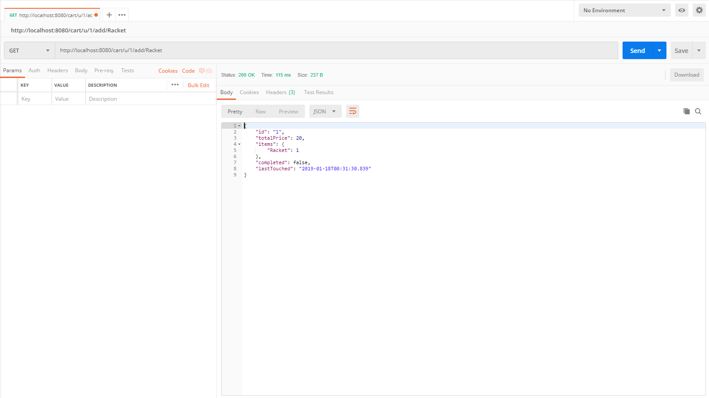

# MarketplaceServerAPI Documentation

## Overview

A server-side web API for an online marketplace. Created in Java using Spring Boot with H2 memory database.

Some key features that were implemented include:

* REST architectural structure
* concurrency compatibility by creating independent carts for each user
* synchronized blocks for purchasing items to avoid the race condition
* made the application loosely coupled, extendable and adaptable by creating multiple interfaces with implementation classes and utilizing the IoC container provided by Spring
* unit and integration tests through JUnit

[Check out how to use the application](#prerequisites)

[Default data](./src/main/resources/data.sql)

## Thought Process

### Framework Choice

I chose Spring Boot to tackle this challenge as the framework offers a lot of functionality including IoCs and an automatic Tomcat Server on startup.

### Application Structure

At first, I created a more bare-bones application using just a Product, Market and some Controller classes, just adding on the basic functionality that a marketplace has. After I got that to work, I added in additional features including a shopping cart so that users could add and buy multiple products at a time. I also designed Service interfaces and implementations to refine the program's structure and allow for flexibility and scalability. These services only focused on one specific model and helped to ensure low coupling between classes. It also helps later on when adding a database implementation. At this point, I also separated the MarketController and added a MarketAdminController here to follow the Single Responsibility Principle. This was because only vendors should have access/the ability to edit their products on the market.

### Model Structure

Note: the product's title is used as the unique key.

    Product {
        String title
        double price
        int inventoryCount
    }

    Cart {
        String id
        double totalPrice
        HashMap<String, Integer> items
        boolean completed
        LocalDateTime lastTouched
    }

Whew, the basic structure is done now.

### Improvement time!! (Multi-threading + Other Features)

After I finished making the marketplace functional for a user, I wanted the web API to work for multiple users, each with their own carts. Because the REST application should be stateless, I added in a CartLocatorService to keep track of users and their instance of the cart. However, because there is no client-side, I could not send back Authentication Tokens through the HTML header. Thus, I had to add in the userIds in the URL itself.

Now, I ran into another problem. The application wasn't thread-safe. To make sure it was, I first made sure that the necessary methods and properties were locked to enforce data consistency (by adding a synchronized block). Mostly, this would be done for the inventory count to ensure that two users cannot buy the same product at the same time (so if the inventory count was 1, then only one user would be able to purchase that one product). Yay, another problem solved!

One of the features that I added to each cart was a timestamp. So, every time a new user enters the marketplace, CartLocatorService determines if any users have abandoned (not updated) their carts in the last 30 minutes. If so, then their cart is deleted. This helps us serve more users by saving memory.

Finally, I added in an in-memory database to deal with saving the list of products on the market (using H2). This was done so that the market/list of products did not have to be static. At this step, I also changed my implementation to prevent users from having the ability to buy a product after it was deleted from the market by the vendor.

And after it was all done, I added unit tests using JUnit to validate business logic and HTTPResponses. Integration tests were also added for the controllers. (Note: Because of the nature of Spring and JUnit4, I had to ignore one test on two class. JUnit was throwing a NoRunnableMethods exception.)

### Google Home Bot

So, realizing that online shopping shouldn't only be done through a website, I utilized DialogFlow to create a Google Home bot as another entry point. Hopefully, I can extend these features later on and have the ability to search for specific products worn or used by popular celebrities or influencers.

### Next Steps

where to go next...

* adding Access Control models to create authentication and authorization mechanisms
* implement a secure payment process
* storing the shopping cart in the database for better user experience by implementing a CartService interface
* develop the ability to have multiple currencies so users around the world can purchase products in a convenient manner
* develop a coupon / promotion ability so vendors can improve their marketing campaigns and increase sales
* design a reporting system so that vendors can better manage their products and inventory
* optimize methods in MarketService for better performance

## Prerequisites

* Java 8
* Maven 3

## Build

Please run the following commands in order:

    mvn clean package

Run the following command in the root folder

    java -jar target/MarketplaceServer.jar

and voila, your Tomcat Server should be up and running.

## Testing

Some unit tests are provided in the application. In order to run the tests, please build and run the jar file first.

    mvn test -DskipTests=false

## API Calls

All API calls are returned as JSON objects.

| Call             | HTTPRequest |  Description               |
| ---------------- | ----------- | -------------------------- |
| /                | GET         | retrieves list of products on the market (returns view from /market) |
| /market          | GET         | retrieves list of products on the market |
| /market/available          | GET         | retrieves all products with available inventory (inventoryCount > 0) |
| /market/{title}  | GET         | retrieves the product with the title "title". if the product does not exist, returns null. |
| /market/purchase/{title} | GET | confirms the purchase of a product with title "title" and returns the product purchased. returns null if purchase fails. |
| /admin/market/add         | POST        | requires a JSON array of Products and adds products to the market |
| /admin/market/update/{title}  | POST        | requires a Product as a JSON object and updates the current product in Market |
| /admin/market/delete/{title}  | DELETE      | deletes the product with title "title" from the market. does not return anything. |
| /u/{userId}/add/{title} | GET   | adds the product with title "title" to the cart and returns the new cart |
| /u/{userId}/add/{title}/{num} | GET   | adds a "num" number of products with title "title" to the cart and returns the new cart |
| /u/{userId}/remove/{title} | DELETE   | removes one of the product with title "title" from the cart and returns the new cart |
| /u/{userId}/remove/{title}/{num} | DELETE   | removes a "num" number of products from the cart (if possible) and returns the new cart |
| /u/{userId}/view       | GET         | returns the current cart |
| /u/{userId}/clear | DELETE   | clears the items from the cart and returns the cleared cart |
| /u/{userId}/checkout | GET   | attempts to purchase all items in the cart |

## Sample Response

GET: ht&#8203;tp://localhost:8080/market

GET: ht&#8203;tp://localhost:8080/cart/u/1/view

**Note:** this cart was already created with 1 racket

